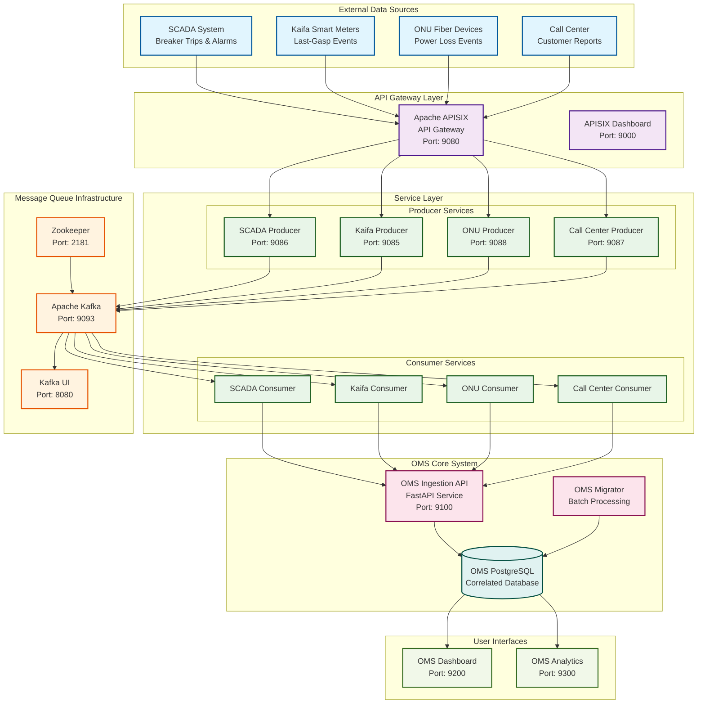
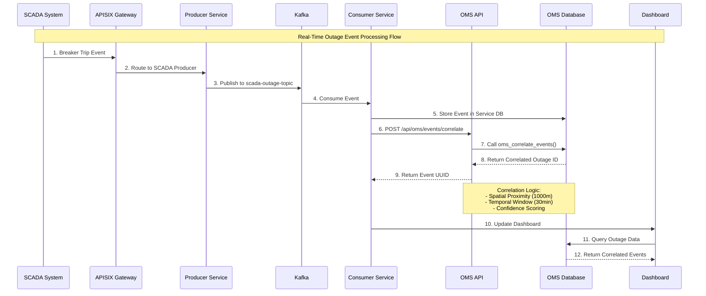
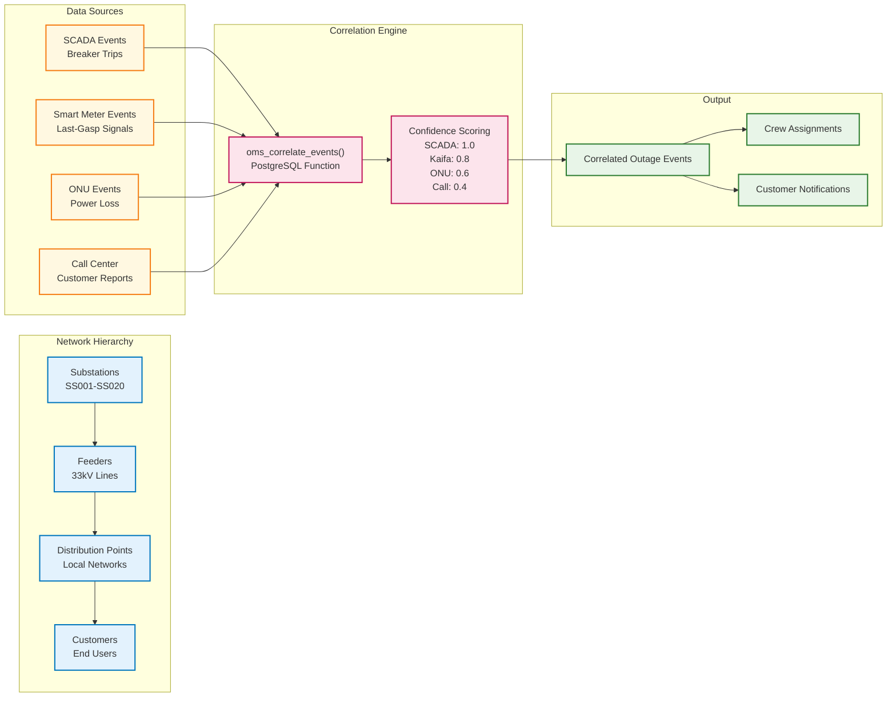
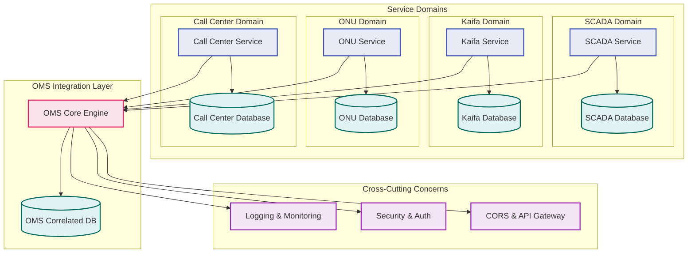
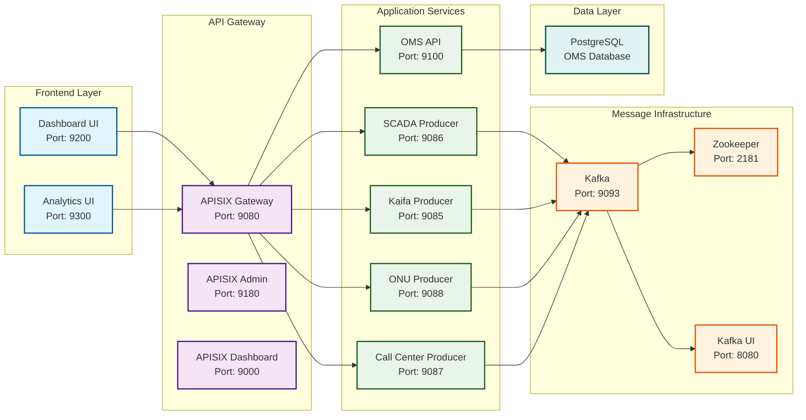

# OMS System Architecture Diagram

## Professional System Architecture Overview

This document provides a comprehensive visual representation of the Outage Management System (OMS) architecture, showing the complete data flow, service interactions, and system components.

## High-Level System Architecture

## Detailed Data Flow Architecture

## Network Topology & Data Correlation

## Service Integration Architecture

## Technology Stack & Ports

## Toolchain & Technology Stack

### **Core Technologies**
- **API Gateway**: Apache APISIX 2.13.1 (Alpine) - High-performance API gateway with built-in plugins
- **Message Queue**: Apache Kafka 7.4.0 with Zookeeper 3.4.15 - Event streaming and real-time data processing
- **Database**: PostgreSQL with PostGIS extension - Relational database with spatial capabilities
- **Containerization**: Docker Compose - Container orchestration and service management

### **Development Stack**
- **Backend Services**: Python 3.9 (FastAPI, Flask) - RESTful APIs and microservices
- **Database ORM**: psycopg2, SQLAlchemy - Database connectivity and ORM
- **Message Processing**: kafka-python - Kafka client for Python
- **Web UI**: HTML5, JavaScript, CSS3 - Frontend dashboards and analytics

### **Infrastructure Tools**
- **Configuration Management**: YAML-based configs for APISIX, Docker Compose
- **Service Discovery**: Docker networking with service names
- **Monitoring**: Kafka UI, APISIX Dashboard, custom logging
- **Data Migration**: Python scripts with psql for database operations

### **Development Workflow**
- **Version Control**: Git with feature branches
- **Container Registry**: Docker Hub for base images
- **Environment Management**: Docker Compose with environment variables
- **Testing**: Unit tests with pytest, integration testing with Docker

This toolchain provides a modern, scalable foundation for real-time event processing and intelligent outage management.

## Key Architecture Principles

### 1. **Microservices Architecture**
- Each service domain (SCADA, Kaifa, ONU, Call Center) operates independently
- Services communicate through well-defined APIs and message queues
- Clear separation of concerns and data ownership

### 2. **Event-Driven Architecture**
- Real-time event processing through Apache Kafka
- Asynchronous communication between services
- Event sourcing for audit trails and replay capabilities

### 3. **API-First Design**
- Apache APISIX as the central API gateway
- RESTful APIs for all service interactions
- CORS support for cross-origin requests

### 4. **Data Correlation Engine**
- Intelligent correlation of events from multiple sources
- Spatial and temporal proximity algorithms
- Confidence scoring based on source reliability

### 5. **Scalable Infrastructure**
- Containerized services with Docker Compose
- Horizontal scaling capabilities
- Load balancing through APISIX

### 6. **Observability & Monitoring**
- Comprehensive logging across all services
- Kafka UI for message queue monitoring
- APISIX Dashboard for API gateway management

## Deployment Architecture

The system is deployed using Docker Compose with the following key characteristics:

- **Single-host deployment** for development and testing
- **Service discovery** through Docker networking
- **Volume persistence** for databases and logs
- **Health checks** and restart policies
- **Environment variable** configuration

## Security Considerations

- **API Gateway** provides centralized security controls
- **CORS policies** configured for cross-origin requests
- **Service isolation** through Docker networking
- **Database access** restricted to application services
- **Audit trails** for all event processing

This architecture provides a robust, scalable foundation for intelligent outage management that can handle high-volume event processing while maintaining data consistency and system reliability.
